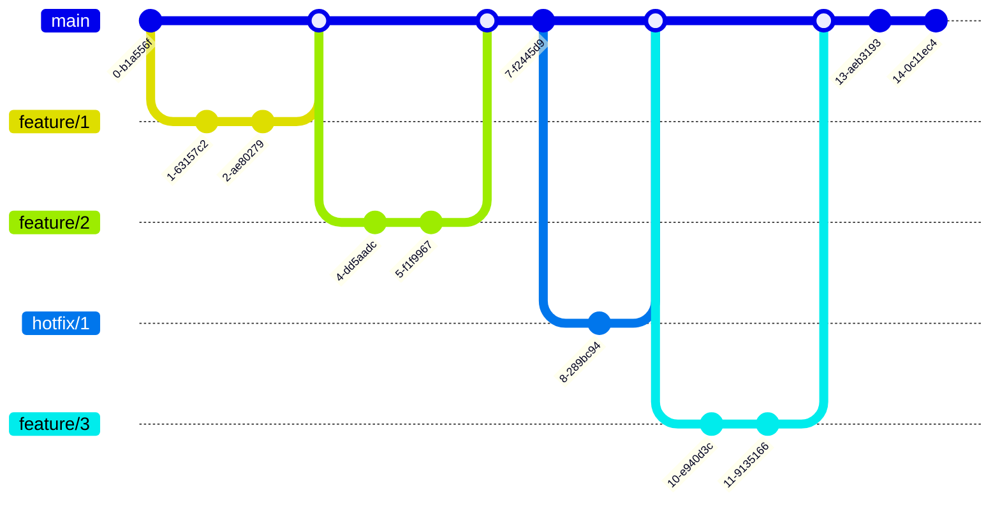

# Summary

In this guide, you will learn all of the following:

1. **Branching Standards**

2. **Commit Messages**

3. **Testing Standards**

4. **Code Review Standards**

> \[!WARNING]
>
> If you do not follow the standards, we will ask you to fix this before approving your pull request. Please follow these standards to ensure a quick review.

## Branching Standards

We follow [Trunk Flow](https://www.toptal.com/software/trunk-based-development-git-flow) which means we only ever branch off of our default branch (usually `main`) and then squash merge back into the *Trunk* aka the default branch. See the examples below.

The Trunk-Based Development workflow visualized in the `gitGraph` diagram shows the main branch (`main`) as the central line of development. Feature branches (`feature/1`, `feature/2`, `feature/3`) are created for individual features, each with multiple commits before being merged back into `main`. A hotfix branch (`hotfix/1`) is also illustrated, addressing critical issues and merging back into `main` after resolution.

## Commit Messages

Commit message standards are crucial for maintaining clarity and consistency in a software development project. Effective commit messages should follow a **clear, structured format: start with a concise, imperative mood summary of the change** (e.g., "Fix bug in user authentication"), followed by a detailed description if necessary, explaining the rationale and impact of the change. This format not only aids in understanding the history and context of the code but also facilitates easier code reviews and troubleshooting.

## Testing Standards

When contributing to the *User Authentication Service*, please follow the following standards:

* You **MUST** write a unit test for all code changes.

* All tests **MUST** pass.

* You **MUST** test your code locally. When we review the code, we expect that you have already tested it thoroughly.

## Code Review Standards

Please follow our [Branching Standards](https://app.joggr.io/app/documents/c80c811a-b3cc-4b6f-b3d7-5cab383ca36f/edit#branching-standards) to ensure a quick review. We review Pull Requests daily. Our SLA for a review is **24 hours**.

> \[!TIP]
>
> If you need an expedited review, please reach out in Slack and explain why.