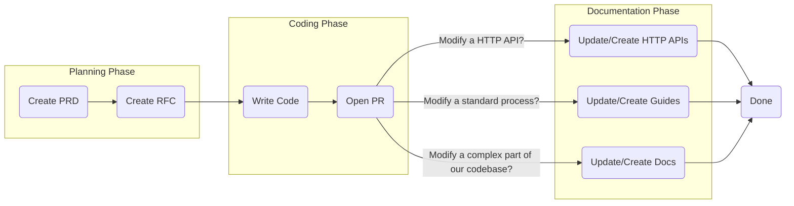

## Overview

This document provides an overview of our documentation process, including all of the following:

* How we integrate documentation into our software development process

* How we define each type of documentation we ask developers to create

**Tip**: If you are looking to learn more about our Documentation standards, please review our [Documentation Standards doc.](https://app.joggr.io)

## Our Process

It's important to understand that documentation is a continuous part of our process and a key component of our SDLC. In regards to documentation, we break the SDLC up into 3 phases. See the [Software Development](https://app.joggr.io/app/documents/113cba46-91f4-4ecd-8458-ffbc8096bbb3) Process document for a full breakdown of our SDLC.

| Phase         | Description                                                                                                                                                                                                         |
| ------------- | ------------------------------------------------------------------------------------------------------------------------------------------------------------------------------------------------------------------- |
| Planning      | During this phase, we are building documentation that we use to plan out the work for a feature. This includes a PRD and a RFC if needed.                                                                           |
| Coding        | During this phase, we are actively coding but while coding can update or add documentation and include it in the PR if needed.                                                                                      |
| Documentation | At this phase we have finished coding and PR code is approved. We will add or finalize any documentation needed based on the code change, meaning anything from adding a Guide to updating the Library `README.md`. |

#### Flow Diagram

## Categories of Documentation

We break down our documents into certain categories based on how we want to group them in our directories, what standards we want to apply to them, and other useful tidbits.

| Category                   | Description                                                                                                                                                                                                                        |
| -------------------------- | ---------------------------------------------------------------------------------------------------------------------------------------------------------------------------------------------------------------------------------- |
| Product Requirements (PRD) | A document that explains all of the business requirements for a given feature.                                                                                                                                                     |
| Request for Comment (RFC)  | A document that outlines the technical approach to building a feature. This often includes answering any open questions or assumptions that were made in the PRD.                                                                  |
| Architecture               | A document that documents the architecture of your product or system.                                                                                                                                                              |
| Guides                     | A document that outlines how to accomplish something (i.e. How to Deploy) in a step-by-step guide.                                                                                                                                 |
| Libraries                  | Generalized documentation for reusable code that is shared within the component. Depending on the context this could be called `Plugins` (Fastify), `Middleware` (Express), `Hooks` (React), `Components` (React) and many others. |
| HTTP API                   | A document that defines the input and output of an API, often providing an example request and response.                                                                                                                           |
