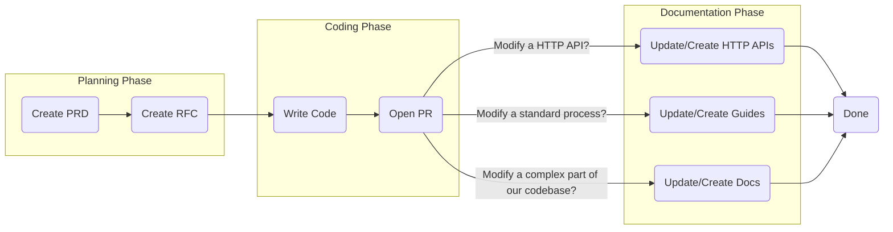

<!--@@joggrdoc@@-->
<!-- @joggr:version(v2):end -->
<!-- @joggr:warning:start -->
<!-- 
  _   _   _    __        __     _      ____    _   _   ___   _   _    ____     _   _   _ 
 | | | | | |   \ \      / /    / \    |  _ \  | \ | | |_ _| | \ | |  / ___|   | | | | | |
 | | | | | |    \ \ /\ / /    / _ \   | |_) | |  \| |  | |  |  \| | | |  _    | | | | | |
 |_| |_| |_|     \ V  V /    / ___ \  |  _ <  | |\  |  | |  | |\  | | |_| |   |_| |_| |_|
 (_) (_) (_)      \_/\_/    /_/   \_\ |_| \_\ |_| \_| |___| |_| \_|  \____|   (_) (_) (_)
                                                              
This document is managed by Joggr. Editing this document could break Joggr's core features, i.e. our 
ability to auto-maintain this document. Please use the Joggr editor to edit this document 
(link at bottom of the page).
-->
<!-- @joggr:warning:end -->
## Overview

We live by three core rules with our documentation:

1. **You cannot tell who wrote the document, only that someone on the team did.**

2. **You can easily grok what a document is based on its name and summary.**

3. **You automatically know where you should be able to find a document based on what you are looking for (aka it's in the right directory).**

If we follow these 3 core rules and our standards it will allow our team to:

* 🚀 **Move faster** - great docs help devs work independently and not get bogged down in question hell.

* 🛹 **Onboard faster** - when you have great docs new devs can easily get up to speed and start contributing.

* 🔮 **Be kind to your *Future Self*** - you will eventually write super complex code and you won't remember why. If you write great docs you can thank your past self for helping you untangle whatever spaghetti is in front of you.

## What You'll Learn

Please read this document, and apply it to your documentation writing! In this document, you will find all of the following:

<table class="dashdraft-table"><tbody><tr class="dashdraft-table-row"><th class="dashdraft-table-header" colspan="1" rowspan="1">
Section
</th><th class="dashdraft-table-header" colspan="1" rowspan="1">
What You'll Learn
</th></tr><tr class="dashdraft-table-row"><td class="dashdraft-table-cell" colspan="1" rowspan="1">
Types of Documentation
</td><td class="dashdraft-table-cell" colspan="1" rowspan="1">
You'll learn about how we define certain types of documentation.
</td></tr><tr class="dashdraft-table-row"><td class="dashdraft-table-cell" colspan="1" rowspan="1">
When to Create JoggrDocs
</td><td class="dashdraft-table-cell" colspan="1" rowspan="1">
You'll learn when we expect developers to create certain types of documentation.
</td></tr><tr class="dashdraft-table-row"><td class="dashdraft-table-cell" colspan="1" rowspan="1">
How to Create JoggrDocs
</td><td class="dashdraft-table-cell" colspan="1" rowspan="1">
You'll learn what we expect when you create documentation (e.g. naming conventions)
</td></tr><tr class="dashdraft-table-row"><td class="dashdraft-table-cell" colspan="1" rowspan="1">
Where to Save Documentation
</td><td class="dashdraft-table-cell" colspan="1" rowspan="1">
You'll learn where to save documentation in Joggr &#x26; GitHub.
</td></tr></tbody></table>

## Software Development Process

It's important to understand that documentation is a continuous part of our process and a key component of our Software Development Process. This diagram provides an overview of how documentation is integrated into our development process.

### Types of Documentation

<table class="dashdraft-table"><tbody><tr class="dashdraft-table-row"><th class="dashdraft-table-header" colspan="1" rowspan="1">
Category
</th><th class="dashdraft-table-header" colspan="1" rowspan="1">
Description
</th></tr><tr class="dashdraft-table-row"><td class="dashdraft-table-cell" colspan="1" rowspan="1">
Product Requirements (PRD)
</td><td class="dashdraft-table-cell" colspan="1" rowspan="1">
A document that explains all of the business requirements for a given feature.
</td></tr><tr class="dashdraft-table-row"><td class="dashdraft-table-cell" colspan="1" rowspan="1">
Request for Comment (RFC)
</td><td class="dashdraft-table-cell" colspan="1" rowspan="1">
A document that outlines the technical approach to building a feature. This often includes answering any open questions or assumptions that were made in the PRD.
</td></tr><tr class="dashdraft-table-row"><td class="dashdraft-table-cell" colspan="1" rowspan="1">
Architecture
</td><td class="dashdraft-table-cell" colspan="1" rowspan="1">
A document that documents the architecture of your product or system.
</td></tr><tr class="dashdraft-table-row"><td class="dashdraft-table-cell" colspan="1" rowspan="1">
Guides
</td><td class="dashdraft-table-cell" colspan="1" rowspan="1">
A document that outlines how to accomplish something (i.e. How to Deploy) in a step-by-step guide.
</td></tr><tr class="dashdraft-table-row"><td class="dashdraft-table-cell" colspan="1" rowspan="1">
HTTP API
</td><td class="dashdraft-table-cell" colspan="1" rowspan="1">
A document that defines the input and output of an API, often providing an example request and response.
</td></tr></tbody></table>

### When to Create JoggrDocs

We expect that software developers create documentation based on the following:

<table class="dashdraft-table"><tbody><tr class="dashdraft-table-row"><th class="dashdraft-table-header" colspan="1" rowspan="1">
PRD
</th><th class="dashdraft-table-header" colspan="1" rowspan="1">
RFC
</th><th class="dashdraft-table-header" colspan="1" rowspan="1">
Arch.
</th><th class="dashdraft-table-header" colspan="1" rowspan="1">
Guides
</th><th class="dashdraft-table-header" colspan="1" rowspan="1">
API
</th></tr><tr class="dashdraft-table-row"><td class="dashdraft-table-cell" colspan="1" rowspan="1">
<strong class="dashdraft-bold">MUST</strong> create and get engineering approval before starting an RFC and/or development.
</td><td class="dashdraft-table-cell" colspan="1" rowspan="1">
<strong class="dashdraft-bold">MUST</strong> be created after approving the PRD and before starting development.
</td><td class="dashdraft-table-cell" colspan="1" rowspan="1">
<strong class="dashdraft-bold">MUST</strong> create an architecture diagram for any new large project
</td><td class="dashdraft-table-cell" colspan="1" rowspan="1">
<strong class="dashdraft-bold">MUST</strong> be created or updated when a new standard process is introduced or an existing one is updated.
</td><td class="dashdraft-table-cell" colspan="1" rowspan="1"><ul class="dashdraft-list"><li class="dashdraft-list-item">
When a new <code class="dashdraft-code-inline">.ts</code> file is added to <code class="dashdraft-code-inline">/routes</code>. <strong class="dashdraft-bold">MUST</strong> create an API doc
</li><li class="dashdraft-list-item">
<strong class="dashdraft-bold">MUST NOT</strong> be able to merge the pull request until the document is created following all standards.
</li></ul></td></tr></tbody></table>

### How to Create JoggrDocs

We expect software developers to follow these standards when creating documentation.

<table class="dashdraft-table"><tbody><tr class="dashdraft-table-row"><th class="dashdraft-table-header" colspan="1" rowspan="1">
PRD
</th><th class="dashdraft-table-header" colspan="1" rowspan="1">
RFC
</th><th class="dashdraft-table-header" colspan="1" rowspan="1">
Arch.
</th><th class="dashdraft-table-header" colspan="1" rowspan="1">
Guides
</th><th class="dashdraft-table-header" colspan="1" rowspan="1">
API
</th></tr><tr class="dashdraft-table-row"><td class="dashdraft-table-cell" colspan="1" rowspan="1">
<strong class="dashdraft-bold">MUST</strong> use the PRD Template
</td><td class="dashdraft-table-cell" colspan="1" rowspan="1">
<strong class="dashdraft-bold">MUST</strong> use the RFC Template
</td><td class="dashdraft-table-cell" colspan="1" rowspan="1">
<strong class="dashdraft-bold">MUST </strong>include a diagram
</td><td class="dashdraft-table-cell" colspan="1" rowspan="1"><ul class="dashdraft-list"><li class="dashdraft-list-item">
<strong class="dashdraft-bold">MUST</strong> use the How-To Guide template
</li><li class="dashdraft-list-item">
The Title <strong class="dashdraft-bold">MUST</strong> start with "How to"
</li></ul></td><td class="dashdraft-table-cell" colspan="1" rowspan="1">
<strong class="dashdraft-bold">MUST</strong> use the API document template
</td></tr></tbody></table>

### Where to Save JoggrDocs

<table class="dashdraft-table"><tbody><tr class="dashdraft-table-row"><th class="dashdraft-table-header" colspan="1" rowspan="1">
Location
</th><th class="dashdraft-table-header" colspan="1" rowspan="1">
PRD
</th><th class="dashdraft-table-header" colspan="1" rowspan="1">
RFC
</th><th class="dashdraft-table-header" colspan="1" rowspan="1">
Arch.
</th><th class="dashdraft-table-header" colspan="1" rowspan="1">
Guides
</th><th class="dashdraft-table-header" colspan="1" rowspan="1">
API
</th></tr><tr class="dashdraft-table-row"><td class="dashdraft-table-cell" colspan="1" rowspan="1">
GitHub
</td><td class="dashdraft-table-cell" colspan="1" rowspan="1">
<code class="dashdraft-code-inline">product/requirements</code>
</td><td class="dashdraft-table-cell" colspan="1" rowspan="1">
<code class="dashdraft-code-inline">/rfcs</code>
</td><td class="dashdraft-table-cell" colspan="1" rowspan="1">
<code class="dashdraft-code-inline">/architecture</code>
</td><td class="dashdraft-table-cell" colspan="1" rowspan="1">
<code class="dashdraft-code-inline">/guides</code>
</td><td class="dashdraft-table-cell" colspan="1" rowspan="1">
<code class="dashdraft-code-inline">/api's</code>
</td></tr><tr class="dashdraft-table-row"><td class="dashdraft-table-cell" colspan="1" rowspan="1">
Joggr
</td><td class="dashdraft-table-cell" colspan="1" rowspan="1">
<code class="dashdraft-code-inline">@docs-repo/requirements</code>
</td><td class="dashdraft-table-cell" colspan="1" rowspan="1">
<code class="dashdraft-code-inline">@repo/docs/rfcs</code>
</td><td class="dashdraft-table-cell" colspan="1" rowspan="1">
<code class="dashdraft-code-inline">@repo/docs/architecture</code>
</td><td class="dashdraft-table-cell" colspan="1" rowspan="1">
<code class="dashdraft-code-inline">@repo/docs/guides</code>
</td><td class="dashdraft-table-cell" colspan="1" rowspan="1">
<a target="_blank" rel="noopener noreferrer" class="dashdraft-link" href="https://api.joggr.io/documentation">https://api.joggr.io/documentation</a>
</td></tr></tbody></table>

### Joggr Directory Structure

Below is our Directory Structure in Joggr. Please make sure to save all documents to the correct position.

<table class="dashdraft-table"><tbody><tr class="dashdraft-table-row"><th class="dashdraft-table-header" colspan="1" rowspan="1">
Folder
</th><th class="dashdraft-table-header" colspan="1" rowspan="1">
Description
</th></tr><tr class="dashdraft-table-row"><td class="dashdraft-table-cell" colspan="1" rowspan="1">
<code class="dashdraft-code-inline">Overview</code>
</td><td class="dashdraft-table-cell" colspan="1" rowspan="1">
Describe in 1-2 sentences what this section holds.
</td></tr><tr class="dashdraft-table-row"><td class="dashdraft-table-cell" colspan="1" rowspan="1">
<code class="dashdraft-code-inline">Standards</code>
</td><td class="dashdraft-table-cell" colspan="1" rowspan="1">
Describe in 1-2 sentences what this section holds.
</td></tr><tr class="dashdraft-table-row"><td class="dashdraft-table-cell" colspan="1" rowspan="1">
<code class="dashdraft-code-inline">Product</code>
</td><td class="dashdraft-table-cell" colspan="1" rowspan="1">
Describe in 1-2 sentences what this section holds.
</td></tr><tr class="dashdraft-table-row"><td class="dashdraft-table-cell" colspan="1" rowspan="1">
<code class="dashdraft-code-inline">Product/Requirements</code>
</td><td class="dashdraft-table-cell" colspan="1" rowspan="1">
Describe in 1-2 sentences what this section holds.
</td></tr><tr class="dashdraft-table-row"><td class="dashdraft-table-cell" colspan="1" rowspan="1">
<code class="dashdraft-code-inline">RFCs</code>
</td><td class="dashdraft-table-cell" colspan="1" rowspan="1">
Describe in 1-2 sentences what this section holds.
</td></tr><tr class="dashdraft-table-row"><td class="dashdraft-table-cell" colspan="1" rowspan="1">
<code class="dashdraft-code-inline">Architecture</code>
</td><td class="dashdraft-table-cell" colspan="1" rowspan="1">
Describe in 1-2 sentences what this section holds.
</td></tr><tr class="dashdraft-table-row"><td class="dashdraft-table-cell" colspan="1" rowspan="1">
<code class="dashdraft-code-inline">Technology</code>
</td><td class="dashdraft-table-cell" colspan="1" rowspan="1">
Describe in 1-2 sentences what this section holds.
</td></tr><tr class="dashdraft-table-row"><td class="dashdraft-table-cell" colspan="1" rowspan="1">
<code class="dashdraft-code-inline">Playground</code>
</td><td class="dashdraft-table-cell" colspan="1" rowspan="1">
Documents that are not outlined in this document, but you want to create.
</td></tr></tbody></table>

<!-- @joggr:editLink(284ccfba-f508-4d64-aaf4-cef948ae6e58):start -->
---

<!-- @joggr:editLink(284ccfba-f508-4d64-aaf4-cef948ae6e58):end -->
