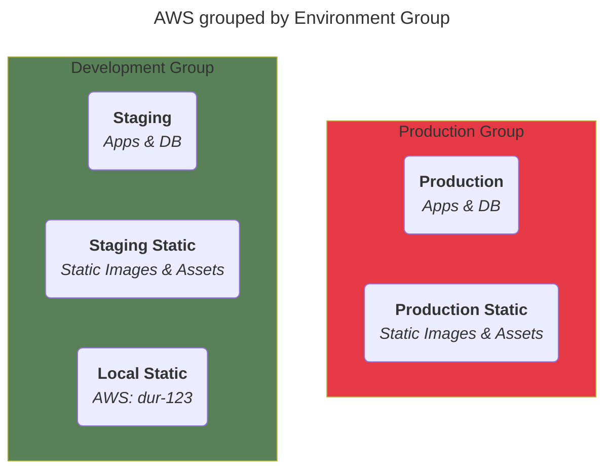

<!--@@joggrdoc@@-->
<!-- @joggr:version(v2):end -->
<!-- @joggr:warning:start -->
<!-- 
  _   _   _    __        __     _      ____    _   _   ___   _   _    ____     _   _   _ 
 | | | | | |   \ \      / /    / \    |  _ \  | \ | | |_ _| | \ | |  / ___|   | | | | | |
 | | | | | |    \ \ /\ / /    / _ \   | |_) | |  \| |  | |  |  \| | | |  _    | | | | | |
 |_| |_| |_|     \ V  V /    / ___ \  |  _ <  | |\  |  | |  | |\  | | |_| |   |_| |_| |_|
 (_) (_) (_)      \_/\_/    /_/   \_\ |_| \_\ |_| \_| |___| |_| \_|  \____|   (_) (_) (_)
                                                              
This document is managed by Joggr. Editing this document could break Joggr's core features, i.e. our 
ability to auto-maintain this document. Please use the Joggr editor to edit this document 
(link at bottom of the page).
-->
<!-- @joggr:warning:end -->
## Overview

This document provides you with an overview of the environments where we deploy our applications, store data and how they map to AWS & other tools.

### Groups (Types)

We have three primary groupings for our environments (also called types), based on how they are utilized. You can see an overview of the primary three groups below.

<table class="dashdraft-table"><tbody><tr class="dashdraft-table-row"><th class="dashdraft-table-header" colspan="1" rowspan="1">
Name
</th><th class="dashdraft-table-header" colspan="1" rowspan="1">
Description
</th><th class="dashdraft-table-header" colspan="1" rowspan="1">
Other Names
</th></tr><tr class="dashdraft-table-row"><td class="dashdraft-table-cell" colspan="1" rowspan="1">
production
</td><td class="dashdraft-table-cell" colspan="1" rowspan="1">
A set of environments for providing software for end user
</td><td class="dashdraft-table-cell" colspan="1" rowspan="1">
prod
</td></tr><tr class="dashdraft-table-row"><td class="dashdraft-table-cell" colspan="1" rowspan="1">
development
</td><td class="dashdraft-table-cell" colspan="1" rowspan="1">
A set of environments for developing software
</td><td class="dashdraft-table-cell" colspan="1" rowspan="1">
pre-production, pre-prod
</td></tr></tbody></table>

To give you a quick overview of that this could look like view the example diagram below:

**NOTE**: this diagram is NOT real as its just a demo of the groups to demonstrate the organization of groups & actual environments.

### Core Environments

Within our core enviroments we

<table class="dashdraft-table"><tbody><tr class="dashdraft-table-row"><th class="dashdraft-table-header" colspan="1" rowspan="1">
Name
</th><th class="dashdraft-table-header" colspan="1" rowspan="1">
Description
</th><th class="dashdraft-table-header" colspan="1" rowspan="1">
Shorthand
</th><th class="dashdraft-table-header" colspan="1" rowspan="1">
Group (Type)
</th></tr><tr class="dashdraft-table-row"><td class="dashdraft-table-cell" colspan="1" rowspan="1">
production
</td><td class="dashdraft-table-cell" colspan="1" rowspan="1">
The environment where we deploy our applications for use by end-users
</td><td class="dashdraft-table-cell" colspan="1" rowspan="1">
prd, prod
</td><td class="dashdraft-table-cell" colspan="1" rowspan="1">
<strong class="dashdraft-bold">production</strong>
</td></tr><tr class="dashdraft-table-row"><td class="dashdraft-table-cell" colspan="1" rowspan="1">
staging
</td><td class="dashdraft-table-cell" colspan="1" rowspan="1">
The environment where we deploy our applications for production-like testing
</td><td class="dashdraft-table-cell" colspan="1" rowspan="1">
stg, stage
</td><td class="dashdraft-table-cell" colspan="1" rowspan="1">
<strong class="dashdraft-bold">development</strong>
</td></tr><tr class="dashdraft-table-row"><td class="dashdraft-table-cell" colspan="1" rowspan="1">
local
</td><td class="dashdraft-table-cell" colspan="1" rowspan="1">
The environment where we develop software locally on our machines
</td><td class="dashdraft-table-cell" colspan="1" rowspan="1">
loc, local
</td><td class="dashdraft-table-cell" colspan="1" rowspan="1">
<strong class="dashdraft-bold">development</strong>
</td></tr></tbody></table>

#### Production

The environment where we deploy our applications for use by end-users. We have different environment configurations for different vendors we use and AWS. View the table below for an overview and link to each system.

<table class="dashdraft-table"><tbody><tr class="dashdraft-table-row"><th class="dashdraft-table-header" colspan="1" rowspan="1">
Name
</th><th class="dashdraft-table-header" colspan="1" rowspan="1">
Description
</th><th class="dashdraft-table-header" colspan="1" rowspan="1">
ID
</th><th class="dashdraft-table-header" colspan="1" rowspan="1">
Link
</th></tr><tr class="dashdraft-table-row"><td class="dashdraft-table-cell" colspan="1" rowspan="1">
AWS
</td><td class="dashdraft-table-cell" colspan="1" rowspan="1">
Our AWS runtime that includes our apps, database, cloud storage and other assets
</td><td class="dashdraft-table-cell" colspan="1" rowspan="1">
id9422
</td><td class="dashdraft-table-cell" colspan="1" rowspan="1">
<a target="_blank" rel="noopener noreferrer" class="dashdraft-link" href="https://google.com">View</a>
</td></tr><tr class="dashdraft-table-row"><td class="dashdraft-table-cell" colspan="1" rowspan="1">
Okta
</td><td class="dashdraft-table-cell" colspan="1" rowspan="1">
Authentication and Authorization vendor for authenticating our end users
</td><td class="dashdraft-table-cell" colspan="1" rowspan="1">
prd-id-123
</td><td class="dashdraft-table-cell" colspan="1" rowspan="1">
<a target="_blank" rel="noopener noreferrer" class="dashdraft-link" href="https://google.com">View</a>
</td></tr><tr class="dashdraft-table-row"><td class="dashdraft-table-cell" colspan="1" rowspan="1">
Third_Party_One
</td><td class="dashdraft-table-cell" colspan="1" rowspan="1">
Our email provider that sends transaction emails on our behalf to our users
</td><td class="dashdraft-table-cell" colspan="1" rowspan="1">
email-sender
</td><td class="dashdraft-table-cell" colspan="1" rowspan="1">
<a target="_blank" rel="noopener noreferrer" class="dashdraft-link" href="https://resend.com/overview">View</a>
</td></tr><tr class="dashdraft-table-row"><td class="dashdraft-table-cell" colspan="1" rowspan="1">
Third_Party_Two
</td><td class="dashdraft-table-cell" colspan="1" rowspan="1">
Our PLG tooling vendor for onboarding and other workflows for our users
</td><td class="dashdraft-table-cell" colspan="1" rowspan="1">
11223
</td><td class="dashdraft-table-cell" colspan="1" rowspan="1">
<a target="_blank" rel="noopener noreferrer" class="dashdraft-link" href="https://us.posthog.com">View</a>
</td></tr><tr class="dashdraft-table-row"><td class="dashdraft-table-cell" colspan="1" rowspan="1">
Third_Party_Three
</td><td class="dashdraft-table-cell" colspan="1" rowspan="1">
Our Product metrics vendor, that provides metrics for our end users and organizations
</td><td class="dashdraft-table-cell" colspan="1" rowspan="1">
prd-tls
</td><td class="dashdraft-table-cell" colspan="1" rowspan="1">
<a target="_blank" rel="noopener noreferrer" class="dashdraft-link" href="https://google.com">View</a>
</td></tr></tbody></table>

#### Staging

The environment where we deploy our applications for testing in a production-like environment. We have different environment configurations for different vendors we use and AWS. View the table below for an overview and link to each system.

**NOTE**: Many of these environments are shared between local and staging due to limitations by our vendors.

<table class="dashdraft-table"><tbody><tr class="dashdraft-table-row"><th class="dashdraft-table-header" colspan="1" rowspan="1">
Name
</th><th class="dashdraft-table-header" colspan="1" rowspan="1">
Description
</th><th class="dashdraft-table-header" colspan="1" rowspan="1">
ID
</th><th class="dashdraft-table-header" colspan="1" rowspan="1">
Link
</th></tr><tr class="dashdraft-table-row"><td class="dashdraft-table-cell" colspan="1" rowspan="1">
AWS
</td><td class="dashdraft-table-cell" colspan="1" rowspan="1">
Our AWS runtime that includes our apps, database, cloud storage in a production-like environment
</td><td class="dashdraft-table-cell" colspan="1" rowspan="1">
id-4456
</td><td class="dashdraft-table-cell" colspan="1" rowspan="1">
<a target="_blank" rel="noopener noreferrer" class="dashdraft-link" href="https://google.com">View</a>
</td></tr><tr class="dashdraft-table-row"><td class="dashdraft-table-cell" colspan="1" rowspan="1">
Okta
</td><td class="dashdraft-table-cell" colspan="1" rowspan="1">
Authentication and Authorization vendor for authenticating our test users
</td><td class="dashdraft-table-cell" colspan="1" rowspan="1">
stg--auth-123
</td><td class="dashdraft-table-cell" colspan="1" rowspan="1">
<a target="_blank" rel="noopener noreferrer" class="dashdraft-link" href="https://google.com">View</a>
</td></tr><tr class="dashdraft-table-row"><td class="dashdraft-table-cell" colspan="1" rowspan="1">
Third_Party_One
</td><td class="dashdraft-table-cell" colspan="1" rowspan="1">
Our email provider that sends transaction emails to our test users in a production-like way
</td><td class="dashdraft-table-cell" colspan="1" rowspan="1">
stg-email-sender
</td><td class="dashdraft-table-cell" colspan="1" rowspan="1">
<a target="_blank" rel="noopener noreferrer" class="dashdraft-link" href="https://resend.com/overview">View</a>
</td></tr><tr class="dashdraft-table-row"><td class="dashdraft-table-cell" colspan="1" rowspan="1">
Third_Party_Two
</td><td class="dashdraft-table-cell" colspan="1" rowspan="1">
Our Product metrics vendor, that we can use to test metrics for our end users and organizations
</td><td class="dashdraft-table-cell" colspan="1" rowspan="1">
31724
</td><td class="dashdraft-table-cell" colspan="1" rowspan="1">
<a target="_blank" rel="noopener noreferrer" class="dashdraft-link" href="https://us.posthog.com">View</a>
</td></tr><tr class="dashdraft-table-row"><td class="dashdraft-table-cell" colspan="1" rowspan="1">
Third_Party_Three
</td><td class="dashdraft-table-cell" colspan="1" rowspan="1">
Our PLG tooling vendor for testing onboarding and other workflows for our users
</td><td class="dashdraft-table-cell" colspan="1" rowspan="1">
dev
</td><td class="dashdraft-table-cell" colspan="1" rowspan="1">
<a target="_blank" rel="noopener noreferrer" class="dashdraft-link" href="https://google.com">View</a>
</td></tr></tbody></table>

#### Local

The environment where we write software locally on our machines.

**NOTE**: Many of these environments are shared between local and staging due to limitations by our vendors.

<table class="dashdraft-table"><tbody><tr class="dashdraft-table-row"><th class="dashdraft-table-header" colspan="1" rowspan="1">
Name
</th><th class="dashdraft-table-header" colspan="1" rowspan="1">
Description
</th><th class="dashdraft-table-header" colspan="1" rowspan="1">
ID
</th><th class="dashdraft-table-header" colspan="1" rowspan="1">
Link
</th></tr><tr class="dashdraft-table-row"><td class="dashdraft-table-cell" colspan="1" rowspan="1">
Docker
</td><td class="dashdraft-table-cell" colspan="1" rowspan="1">
Our local runtime that includes our apps, database, cloud storage in a production-like environment
</td><td class="dashdraft-table-cell" colspan="1" rowspan="1">
-
</td><td class="dashdraft-table-cell" colspan="1" rowspan="1">
-
</td></tr><tr class="dashdraft-table-row"><td class="dashdraft-table-cell" colspan="1" rowspan="1">
AWS
</td><td class="dashdraft-table-cell" colspan="1" rowspan="1">
Our AWS runtime that includes assets we cannot mirror in Docker, i.e. Cloud Storage
</td><td class="dashdraft-table-cell" colspan="1" rowspan="1">
dev-123
</td><td class="dashdraft-table-cell" colspan="1" rowspan="1">
<a target="_blank" rel="noopener noreferrer" class="dashdraft-link" href="https://google.com">View</a>
</td></tr><tr class="dashdraft-table-row"><td class="dashdraft-table-cell" colspan="1" rowspan="1">
Auth0
</td><td class="dashdraft-table-cell" colspan="1" rowspan="1">
Authentication and Authorization vendor for authenticating our test users
</td><td class="dashdraft-table-cell" colspan="1" rowspan="1">
local--app-123
</td><td class="dashdraft-table-cell" colspan="1" rowspan="1">
<a target="_blank" rel="noopener noreferrer" class="dashdraft-link" href="https://google.com">View</a>
</td></tr><tr class="dashdraft-table-row"><td class="dashdraft-table-cell" colspan="1" rowspan="1">
Third_Party_One
</td><td class="dashdraft-table-cell" colspan="1" rowspan="1">
Our email provider for testing emails locally
</td><td class="dashdraft-table-cell" colspan="1" rowspan="1">
local-app.acme.com
</td><td class="dashdraft-table-cell" colspan="1" rowspan="1">
<a target="_blank" rel="noopener noreferrer" class="dashdraft-link" href="https://resend.com/overview">View</a>
</td></tr><tr class="dashdraft-table-row"><td class="dashdraft-table-cell" colspan="1" rowspan="1">
Third_Party_Two
</td><td class="dashdraft-table-cell" colspan="1" rowspan="1">
Our Product metrics vendor, that we can use to test metrics for our end users and organizations
</td><td class="dashdraft-table-cell" colspan="1" rowspan="1">
349354
</td><td class="dashdraft-table-cell" colspan="1" rowspan="1">
<a target="_blank" rel="noopener noreferrer" class="dashdraft-link" href="https://us.posthog.com">View</a>
</td></tr><tr class="dashdraft-table-row"><td class="dashdraft-table-cell" colspan="1" rowspan="1">
Third_Party_Three
</td><td class="dashdraft-table-cell" colspan="1" rowspan="1">
Our PLG tooling vendor for testing onboarding and other workflows for our users
</td><td class="dashdraft-table-cell" colspan="1" rowspan="1">
dev-9247
</td><td class="dashdraft-table-cell" colspan="1" rowspan="1">
<a target="_blank" rel="noopener noreferrer" class="dashdraft-link" href="https://google.com">View</a>
</td></tr></tbody></table>

<!-- @joggr:editLink(dfa96944-04f1-4624-a05f-31d6349ff349):start -->
---

<!-- @joggr:editLink(dfa96944-04f1-4624-a05f-31d6349ff349):end -->
