## Overview

This document provides you with an overview of the environments where we deploy our applications, store data and how they map to AWS & other tools.

### Groups (Types)

We have three primary groupings for our environments (also called types), based on how they are utilized. You can see an overview of the primary three groups below.

| Name        | Description                                                                                           | Other Names              |
| ----------- | ----------------------------------------------------------------------------------------------------- | ------------------------ |
| production  | A set of environments for providing software for end user                                             | prod                     |
| development | A set of environments for developing software                                                         | pre-production, pre-prod |

To give you a quick overview of that this could look like view the example diagram below:

```mermaid
---
title: AWS grouped by Environment Group
---
flowchart TB;
  subgraph prd["Production Group"]
    gcp-prd("`**Production**
_Apps & DB_
`")
    gcp-prd-static("`**Production Static**
_Static Images & Assets_
`")
  end
  style prd fill:#e63946

  subgraph dev["Development Group"]
    gcp-stg("`**Staging**
_Apps & DB_
`")
    gcp-stg-static("`**Staging Static**
_Static Images & Assets_
`")
    gcp-local-static("`**Local Static**
_GCP: durable-catty-333_
`")
  end
  style dev fill:#588157

  subgraph ops["Operations Group"]
    gcp-vault("`**Vault**
_Backup for GitHub Repos_
`")
    gcp-vault("`**Scotty**
_Docker Images & DevOps Apps_
`")
  end
  style ops fill:#1d3557
```

**NOTE**: this diagram is NOT real as its just a demo of the groups to demonstrate the organization of groups & actual environments.

### Core Environments

Within our core enviroments we

| Name       | Description                                                                  | Shorthand  | Group (Type)    |
| ---------- | ---------------------------------------------------------------------------- | ---------- | --------------- |
| production | The environment where we deploy our applications for use by end-users        | prd, prod  | **production**  |
| staging    | The environment where we deploy our applications for production-like testing | stg, stage | **development** |
| local      | The environment where we develop software locally on our machines            | loc, local | **development** |

#### Production

The environment where we deploy our applications for use by end-users. We have different environment configurations for different vendors we use and AWS. View the table below for an overview and link to each system.

| Name         | Description                                                                           | ID                  | Link                                                                        |
| ------------ | ------------------------------------------------------------------------------------- | ------------------- | --------------------------------------------------------------------------- |
| AWS | Our AWS runtime that includes our apps, database, cloud storage and other assets      | id9422  | [View](https://google.com) |
| Okta        | Authentication and Authorization vendor for authenticating our end users              | prd-id-123 | [View](https://google.com)          |
| Third_Party_One       | Our email provider that sends transaction emails on our behalf to our users           | email-sender       | [View](https://resend.com/overview)                                         |
| Third_Party_Two      | Our PLG tooling vendor for onboarding and other workflows for our users               | 11223              | [View](https://us.posthog.com)                                |
| Third_Party_Three     | Our Product metrics vendor, that provides metrics for our end users and organizations | prd-tls                 | [View](https://google.com)                          |

#### Staging

The environment where we deploy our applications for testing in a production-like environment. We have different environment configurations for different vendors we use and AWS. View the table below for an overview and link to each system.

**NOTE**: Many of these environments are shared between local and staging due to limitations by our vendors.

| Name         | Description                                                                                      | ID                     | Link                                                                              |
| ------------ | ------------------------------------------------------------------------------------------------ | ---------------------- | --------------------------------------------------------------------------------- |
| AWS | Our AWS runtime that includes our apps, database, cloud storage in a production-like environment | id-4456 | [View](https://google.com)   |
| Okta        | Authentication and Authorization vendor for authenticating our test users                        | stg--auth-123    | [View](https://google.com)                |
| Third_Party_One       | Our email provider that sends transaction emails to our test users in a production-like way      | stg-email-sender       | [View](https://resend.com/overview)                                               |
| Third_Party_Two       | Our Product metrics vendor, that we can use to test metrics for our end users and organizations  | 31724                  | [View](https://us.posthog.com)                                      |
| Third_Party_Three       | Our PLG tooling vendor for testing onboarding and other workflows for our users                  | dev                    | [View](https://google.com)                                |

#### Local

The environment where we write software locally on our machines.

**NOTE**: Many of these environments are shared between local and staging due to limitations by our vendors.

| Name         | Description                                                                                        | ID                 | Link                                                                            |
| ------------ | -------------------------------------------------------------------------------------------------- | ------------------ | ------------------------------------------------------------------------------- |
| Docker       | Our local runtime that includes our apps, database, cloud storage in a production-like environment | -                  | -                                                                               |
| AWS | Our AWS runtime that includes assets we cannot mirror in Docker, i.e. Cloud Storage                | dev-123| [View](https://google.com)     |
| Auth0        | Authentication and Authorization vendor for authenticating our test users                          | local--app-123 | [View](https://google.com)               |
| Third_Party_One        | Our email provider for testing emails locally                                                      | local-app.acme.com | [View](https://resend.com/overview)                                             |
| Third_Party_Two      | Our Product metrics vendor, that we can use to test metrics for our end users and organizations    | 349354              | [View](https://us.posthog.com)                                    |
| Third_Party_Three      | Our PLG tooling vendor for testing onboarding and other workflows for our users                    | dev-9247                | [View](https://google.com)  
