<!--@@joggrdoc@@-->
<!-- @joggr:version(v2):end -->
<!-- @joggr:warning:start -->
<!-- 
  _   _   _    __        __     _      ____    _   _   ___   _   _    ____     _   _   _ 
 | | | | | |   \ \      / /    / \    |  _ \  | \ | | |_ _| | \ | |  / ___|   | | | | | |
 | | | | | |    \ \ /\ / /    / _ \   | |_) | |  \| |  | |  |  \| | | |  _    | | | | | |
 |_| |_| |_|     \ V  V /    / ___ \  |  _ <  | |\  |  | |  | |\  | | |_| |   |_| |_| |_|
 (_) (_) (_)      \_/\_/    /_/   \_\ |_| \_\ |_| \_| |___| |_| \_|  \____|   (_) (_) (_)
                                                              
This document is managed by Joggr. Editing this document could break Joggr's core features, i.e. our 
ability to auto-maintain this document. Please use the Joggr editor to edit this document 
(link at bottom of the page).
-->
<!-- @joggr:warning:end -->
## Overview

This document provides you with an overview of the services (applications), vendors and other assets that make up the our platform and how they interact.

### Services (Applications)

There are four primary services that make up our platform.

| Service    | Description                                                                                                                                                | Endpoint                      | GitHub                                         |
| ---------- | ---------------------------------------------------------------------------------------------------------------------------------------------------------- | ----------------------------- | ---------------------------------------------- |
| **API**    | The ENTER_COMPANY **API** is the main API for our Platform. It is responsible for all of the business logic and data storage for the Platform.         | `https://api.acme.io`        | [View](https://github.com) |
| **Web**    | The ENTER_COMPANY **Web** consists of a React-based application that is a SPA.                                                                                     | `https://app.acme.io`        | [View](https://github.com)  |
| **Server** | The ENTER_COMPANY **Server** is a Fastify based API that serves the **Web** to the client.                                                                         | `https://app.acme.io`        | [View](https://github.com)  |
| **Third-Party Service** | The ENTER_COMPANY  **Third-Party Service** is a proxy API for ENTER_REASON. It is responsible for ENTER_REASON. | `https://app.acme.io` | [View](https://github.com)      |

#### Diagram

``` mermaid
---
title: Acme Inc. Service Architecture
---
flowchart TD

  %% Our Services
  %% -------

  web["`🌐 **Web**
*Web Client*`"];
  style web fill:#7b1fa2;

  api["`⬆️ **API**
*Backend API*`"];

  server["`**💻 Server**
*Web Server*`"];
  style server fill:#7b1fa2;

  third-party["`🐙 **Third-Party**
*Third-Party Proxy API & App*`"];

  %% Third Party Services
  %% -------

  database[("`🐘 **MicrosoftSQL**
*(CloudSql)*`")]
  style database fill:#0064a5

  bucket["`🪣 **Storage Bucket**
(Cloud Storage)
`"]
  style bucket fill:#0064a5

  Okta[["`**Okta.com**
*(vendor)*`"]]
  thirdpartyapi[["`**thirdparty.com**
*(vendor)*`"]]  

  %% Core Mappings
  web -- "app.acme.io" --> server;
  web <-- "api.acme.io" --> api;
  web <-- "cdn.acme.io" --> api;
  api <-- "Proxy CDN Assets" --> bucket
  api <-- "Authenticate & Authorize" --> Okta;
  web <-- "Login (Authenticate)" --> Okta;
  third-party <-- "Proxy API Requests" --> thirdpartyapi;
  api -- "Query DB" --> database;

  subgraph vpc["🛜 Joggr"]
    direction TB;
    api -- "GitHub Query" --> third-party;
    server;
    api;
  end
  style vpc fill:#6da2f7,color:#000000,stroke:#333,stroke-width:2px;

  subgraph gcp["💽 AWS Managed Services"]
    direction TB;
    database;
    bucket;
  end
  style gcp fill:#4285F4,stroke:#333,stroke-width:2px;

  subgraph "🏪 Vendors"
    direction TB
    thirdpartyapi;
    Okta;
  end

  linkStyle default stroke-width:4px,fill:none,stroke:black;
```

<!-- @joggr:editLink(086ba8d2-cb0b-44bc-8a19-71e56349924c):start -->
---

<!-- @joggr:editLink(086ba8d2-cb0b-44bc-8a19-71e56349924c):end -->