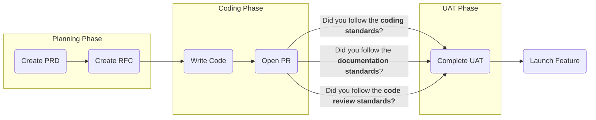

<!--@@joggrdoc@@-->
<!-- @joggr:version(v2):end -->
<!-- @joggr:warning:start -->
<!-- 
  _   _   _    __        __     _      ____    _   _   ___   _   _    ____     _   _   _ 
 | | | | | |   \ \      / /    / \    |  _ \  | \ | | |_ _| | \ | |  / ___|   | | | | | |
 | | | | | |    \ \ /\ / /    / _ \   | |_) | |  \| |  | |  |  \| | | |  _    | | | | | |
 |_| |_| |_|     \ V  V /    / ___ \  |  _ <  | |\  |  | |  | |\  | | |_| |   |_| |_| |_|
 (_) (_) (_)      \_/\_/    /_/   \_\ |_| \_\ |_| \_| |___| |_| \_|  \____|   (_) (_) (_)
                                                              
This document is managed by Joggr. Editing this document could break Joggr's core features, i.e. our 
ability to auto-maintain this document. Please use the Joggr editor to edit this document 
(link at bottom of the page).
-->
<!-- @joggr:warning:end -->
# Overview

The following document outlines our software development process and the expectations for developers at each phase.

**Tip**: If you have a question or want to propose a change, please open a pull request and ask the team for feedback.

# Software Development Process

## Flow Diagram

Below is our software development process.

## Phases

| Phase                           | Description                                                                                                                                                                                          | Definition of Done                                                                                                                                                                                                                                                                                                                                                                                                                                                                                                                |
| ------------------------------- | ---------------------------------------------------------------------------------------------------------------------------------------------------------------------------------------------------- | --------------------------------------------------------------------------------------------------------------------------------------------------------------------------------------------------------------------------------------------------------------------------------------------------------------------------------------------------------------------------------------------------------------------------------------------------------------------------------------------------------------------------------- |
| Requirements                    | During this stage, we review the PRD as an engineering team and get all of our questions answered before we start development.                                                                       | All engineers **MUST** sign off on the PRD by approving the pull request.                                                                                                                                                                                                                                                                                                                                                                                                                                                         |
| Technical Discovery             | Before starting development, we complete an RFC to scope out the work for the PRD.                                                                                                                   | All engineers **MUST** sign off on the approach outlined in the RFC by approving the pull request. The Engineering Team **MUST** be able to tell the Product Team how long the feature will take. The Engineering Team and Product Team **MUST** agree to any increase or decrease in scope that came from the RFC learnings. All changes to requirements that come from the RFC learnings **MUST** be updated in the PRD.                                                                                                        |
| Write & Review Code             | We write the code for the features we agreed upon in the PRD and open a Pull Request to get the other engineers on the team's feedback. All testing at this stage is done via a preview environment. | The engineering team **MUST** write the code for the feature, following all [Code Style Standards](https://app.joggr.io). The engineering team **MUST** sign off on the Pull Request and follow all [Code Review Standards](https://app.joggr.io/). The engineering team **MUST** document the feature(s), following all [Documentation Standards](https://app.joggr.io). |
| User Acceptance Testing ("UAT") | The product manager who wrote the PRD tests the feature to ensure the engineering team completed all of the requirements.                                                                            | The Engineering Team **MUST** deploy the feature to staging, so the Product Manager can complete UAT. The Product Manager **MUST** sign off that the feature is ready to deploy to production.                                                                                                                                                                                                                                                                                                                                    |
| Launch Feature                  | The engineering team deploys the feature to production, does a quick smoke test, and the product manager announces the feature to our users.                                                         | The Engineering Team **MUST** deploy the feature to production, complete a quick smoke test, and **MUST** let the Product Team know when this is complete. The Product Team **MUST** announce this feature to the users.  

<!-- @joggr:editLink(a5da2620-80ba-4fe6-a038-3b83a7326f1a):start -->
---

<!-- @joggr:editLink(a5da2620-80ba-4fe6-a038-3b83a7326f1a):end -->